# Software Architecture Document : Bello Beauty Academy Platform

**Document Version:** 2.0
**Date:** May 2026
**Status:** Updated — Assignment 12

---

## Project Title

**Bello Beauty Academy Platform**

*A professional web-based management system for the Bello Beauty Academy, offering certified training courses in lash artistry, brow techniques, nail technology, and makeup artistry.*

---

## Domain

The Bello Beauty Academy Platform operates within the **Beauty Education and Professional Training** domain. Beauty academies are educational institutions focused exclusively on training aspiring beauty professionals. Unlike beauty salons or spas that deliver services to end customers, beauty academies provide structured certification programs covering lash artistry, brow techniques, nail technology, and makeup artistry. Students enroll in formal training programs, learn practical techniques under qualified trainers, and earn recognised industry certifications upon successful completion.

The domain is characterised by a need to manage students, trainers, courses, class schedules, practical assessments, and certification records, all of which require a purpose-built digital management platform to replace the manual and informal processes currently in use.

---

## Problem Statement

The Bello Beauty Academy currently manages its training operations through a combination of manual processes, spreadsheets, and informal communication channels such as WhatsApp and phone calls. This approach results in inefficient student enrollment, uncoordinated class scheduling, incomplete progress records, manual certificate issuance, and a lack of operational visibility for management. The Bello Beauty Academy Platform is proposed as a web-based management system that will resolve these challenges by digitising and automating the core operations of the academy.

---

## Individual Scope

The core features: student enrollment, course management, trainer management, class scheduling, progress tracking, payment confirmation, and certificate generation form a complete and cohesive system that addresses all the identified problems. Complex features such as online card payment processing and live virtual classes have been deliberately deferred to future releases and documented in the Future Scope section of the specification. The system is built using widely adopted technologies (React.js, Node.js, PostgreSQL) that are well documented and supported, making the implementation feasible within the project timeline.

---

## Table of Contents

1. [Architecture Overview](#1-architecture-overview)
2. [Architecture Style](#2-architecture-style)
3. [System Components](#3-system-components)
4. [C4 Level 1 — System Context Diagram](#4-c4-level-1--system-context-diagram)
5. [C4 Level 2 — Container Diagram](#5-c4-level-2--container-diagram)
6. [C4 Level 3 — Component Diagram](#6-c4-level-3--component-diagram)
7. [C4 Level 4 — Dynamic Diagram](#7-c4-level-4--dynamic-diagram)
8. [C4 Level 5 — Deployment Diagram](#8-c4-level-5--deployment-diagram)
9. [Data Flow Description](#9-data-flow-description)
10. [Technology Stack](#10-technology-stack)
11. [API Documentation — Swagger UI](#11-api-documentation--swagger-ui)

---

## 1. Architecture Overview

The **Bello Beauty Academy Platform** is designed as a modern, **layered web application** following a client-server model. The system separates concerns clearly across the presentation layer, business logic layer, and data layer. This separation ensures that each component can be developed, tested, and maintained independently.

The architecture prioritises:

- **Separation of Concerns** — the frontend, backend API, and database are independently deployable units
- **Role-Based Access Control** — each user role (Student, Trainer, Administrator) has strictly scoped access
- **Service Isolation** — specialised functions such as payment tracking, certificate generation, and email notifications are handled by dedicated services
- **Scalability** — the containerised deployment model supports horizontal scaling
- **Security** — all inter-service communication is authenticated and encrypted

---

## 2. Architecture Style

The system adopts a **modular monolith backend** architecture for this first version. The backend API is structured as a single deployable application with clearly separated internal modules. This approach keeps the codebase maintainable and can be evolved into microservices in future iterations.

**Architecture pattern:** Layered MVC (Model-View-Controller) with service layer
**API style:** RESTful HTTP API

---

## 3. System Components

### 4.1 Frontend Web Application

A **React.js Single Page Application (SPA)** that provides the user interface for all three user roles — Students, Trainers, and Administrators. The frontend communicates with the backend exclusively via the REST API over HTTPS. It renders role-specific dashboards and views based on the authenticated user's role, including a proof of payment upload form and a payment status view.

### 4.2 Backend REST API

A **Node.js + Express.js** application serving as the core of the system. All business logic is organised into the following internal modules:

- **User Management Module** — registration, login, and profile management
- **Course Management Module** — CRUD operations for courses and categories
- **Student Enrollment Module** — enrollment lifecycle management; blocks course access until payment is confirmed
- **Payment Management Module** — tracks payment status, handles proof of payment uploads, and supports admin manual confirmation for cash and EFT payments
- **Schedule Management Module** — training session scheduling and trainer assignment
- **Progress Tracking Module** — attendance and competency assessment records
- **Certificate Generation Module** — PDF certificate generation and issuance
- **Notification Module** — transactional email dispatch

### 4.3 Database

A **PostgreSQL** relational database persisting all system data: users, courses, enrollments, payments, sessions, attendance, assessments, certificates, and course materials.

### 4.4 Authentication Service

A **JWT-based authentication service** embedded in the backend. Handles registration, login, password hashing (bcrypt), token issuance, token validation, and role-based access enforcement on every protected API endpoint.

### 4.5 Payment Management Service

A dedicated internal service managing all payment-related operations. The student uploads a proof of payment document after making payment. The administrator reviews it on the payment dashboard and confirms or rejects it. On confirmation, the enrollment is automatically activated and the student receives an email notification.

### 4.6 Certificate Generation Service

A **PDF generation service** using Puppeteer or PDFKit. Generates branded PDF certificates containing the student's name, course name, completion date, and a unique certificate number.

### 4.7 Notification Service

An **email notification service** using NodeMailer and SendGrid. Dispatches enrollment confirmations, payment notifications, schedule updates, and certificate ready alerts.

---

## 4. C4 Level 1 — System Context Diagram

This diagram shows the Bello Beauty Academy Platform at the highest level — the actors who interact with it and the external systems it depends on.

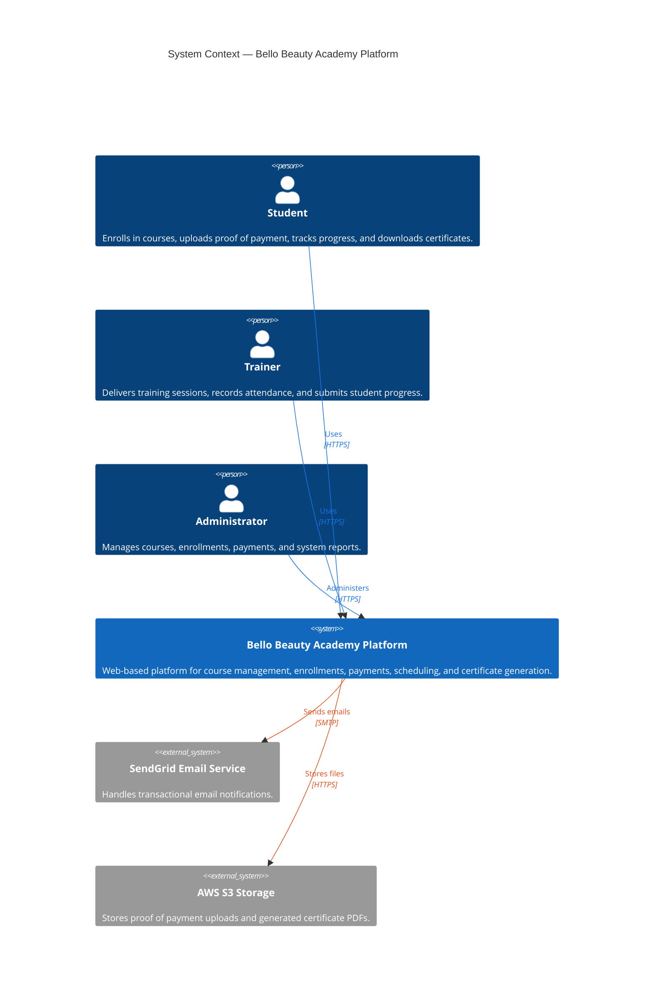
```mermaid
C4Context
    title System Context — Bello Beauty Academy Platform

    Person(student, "Student", "Enrolls in courses, uploads proof of payment, tracks progress, and downloads certificates.")
    Person(trainer, "Trainer", "Delivers training sessions, records attendance, and submits student progress.")
    Person(admin, "Administrator", "Manages courses, enrollments, payments, and system reports.")

    System(platform, "Bello Beauty Academy Platform", "Web-based platform for course management, enrollments, payments, scheduling, and certificate generation.")

    System_Ext(email, "SendGrid Email Service", "Handles transactional email notifications.")
    System_Ext(storage, "AWS S3 Storage", "Stores proof of payment uploads and generated certificate PDFs.")

    Rel(student, platform, "Uses", "HTTPS")
    Rel(trainer, platform, "Uses", "HTTPS")
    Rel(admin, platform, "Administers", "HTTPS")
    Rel(platform, email, "Sends emails", "SMTP")
    Rel(platform, storage, "Stores files", "HTTPS")

    UpdateRelStyle(student, platform, $textColor="#1a73e8", $lineColor="#1a73e8")
    UpdateRelStyle(trainer, platform, $textColor="#1a73e8", $lineColor="#1a73e8")
    UpdateRelStyle(admin, platform, $textColor="#1a73e8", $lineColor="#1a73e8")
    UpdateRelStyle(platform, email, $textColor="#e84d1a", $lineColor="#e84d1a")
    UpdateRelStyle(platform, storage, $textColor="#e84d1a", $lineColor="#e84d1a")

    UpdateLayoutConfig($c4ShapeInRow="3", $c4BoundaryInRow="1")
```

**Relationship Legend**

| Colour | From | To | Relationship | Protocol |
|--------|------|----|-------------|----------|
| 🔵 Blue | Student | Bello Beauty Academy Platform | Uses the platform to enroll, track progress, and download certificates | HTTPS |
| 🔵 Blue | Trainer | Bello Beauty Academy Platform | Uses the platform to manage sessions and record student progress | HTTPS |
| 🔵 Blue | Administrator | Bello Beauty Academy Platform | Administers courses, enrollments, payments, and reports | HTTPS |
| 🔴 Red | Bello Beauty Academy Platform | SendGrid Email Service | Sends enrollment, payment, and certificate email notifications | SMTP/HTTPS |
| 🔴 Red | Bello Beauty Academy Platform | AWS S3 Storage | Stores proof of payment uploads and generated certificate PDFs | HTTPS |

---

## 5. C4 Level 2 — Container Diagram

This diagram zooms into the Bello Beauty Academy Platform to show the applications and data stores that exist inside the software system boundary, their technology choices, and how they communicate with each other and with the external systems shown in the Context diagram.

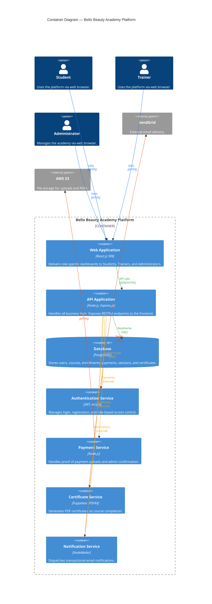
```mermaid
C4Container
    title Container Diagram — Bello Beauty Academy Platform

    Person(student, "Student", "Uses the platform via web browser.")
    Person(trainer, "Trainer", "Uses the platform via web browser.")
    Person(admin, "Administrator", "Manages the academy via web browser.")

    Container_Boundary(c1, "Bello Beauty Academy Platform") {
        Container(webApp, "Web Application", "React.js SPA", "Delivers role-specific dashboards to Students, Trainers, and Administrators.")
        Container(api, "API Application", "Node.js, Express.js", "Handles all business logic. Exposes RESTful endpoints to the frontend.")
        ContainerDb(db, "Database", "PostgreSQL", "Stores users, courses, enrollments, payments, sessions, and certificates.")
        Container(authSvc, "Authentication Service", "JWT, bcrypt", "Manages login, registration, and role-based access control.")
        Container(paymentSvc, "Payment Service", "Node.js", "Handles proof of payment uploads and admin confirmation.")
        Container(certSvc, "Certificate Service", "Puppeteer, PDFKit", "Generates PDF certificates on course completion.")
        Container(notifSvc, "Notification Service", "NodeMailer", "Dispatches transactional email notifications.")
    }

    System_Ext(email, "SendGrid", "External email delivery.")
    System_Ext(storage, "AWS S3", "File storage for uploads and PDFs.")

    Rel(student, webApp, "Uses", "HTTPS")
    Rel(trainer, webApp, "Uses", "HTTPS")
    Rel(admin, webApp, "Uses", "HTTPS")
    Rel(webApp, api, "API calls", "JSON/HTTPS")
    Rel(api, db, "Read/write", "SQL")
    Rel(api, authSvc, "Authenticates", "JWT")
    Rel(api, paymentSvc, "Payments", "Internal")
    Rel(api, certSvc, "Certificates", "Internal")
    Rel(api, notifSvc, "Notifications", "Internal")
    Rel(notifSvc, email, "Sends", "SMTP")
    Rel(paymentSvc, storage, "Stores", "HTTPS")

    UpdateRelStyle(student, webApp, $textColor="#1a73e8", $lineColor="#1a73e8")
    UpdateRelStyle(trainer, webApp, $textColor="#1a73e8", $lineColor="#1a73e8")
    UpdateRelStyle(admin, webApp, $textColor="#1a73e8", $lineColor="#1a73e8")
    UpdateRelStyle(webApp, api, $textColor="#34a853", $lineColor="#34a853")
    UpdateRelStyle(api, db, $textColor="#34a853", $lineColor="#34a853")
    UpdateRelStyle(api, authSvc, $textColor="#f4a800", $lineColor="#f4a800")
    UpdateRelStyle(api, paymentSvc, $textColor="#f4a800", $lineColor="#f4a800")
    UpdateRelStyle(api, certSvc, $textColor="#f4a800", $lineColor="#f4a800")
    UpdateRelStyle(api, notifSvc, $textColor="#f4a800", $lineColor="#f4a800")
    UpdateRelStyle(notifSvc, email, $textColor="#e84d1a", $lineColor="#e84d1a")
    UpdateRelStyle(paymentSvc, storage, $textColor="#e84d1a", $lineColor="#e84d1a")

    UpdateLayoutConfig($c4ShapeInRow="3", $c4BoundaryInRow="1")
```

**Relationship Legend**

| Colour | From | To | Relationship | Protocol |
|--------|------|----|-------------|----------|
| 🔵 Blue | Student / Trainer / Admin | Web Application | Accesses role-specific dashboard via web browser | HTTPS |
| 🟢 Green | Web Application | API Application | Sends all requests to the backend REST API | JSON/HTTPS |
| 🟢 Green | API Application | Database | Reads and writes all platform data | SQL |
| 🟠 Orange | API Application | Authentication Service | Validates user identity and enforces role-based access | JWT |
| 🟠 Orange | API Application | Payment Service | Delegates all proof of payment and confirmation operations | Internal |
| 🟠 Orange | API Application | Certificate Service | Requests branded PDF certificate generation | Internal |
| 🟠 Orange | API Application | Notification Service | Triggers transactional email dispatch | Internal |
| 🔴 Red | Notification Service | SendGrid | Sends enrollment, payment, and certificate emails | SMTP/HTTPS |
| 🔴 Red | Payment Service | AWS S3 | Stores uploaded proof of payment files | HTTPS |

---

## 6. C4 Level 3 — Component Diagram

This diagram zooms into the API Application container and shows the components that reside inside it.


```mermaid
C4Component
    title Component Diagram — API Application

    Person(student, "Student", "Uses the platform via web browser.")
    Person(admin, "Administrator", "Manages the academy via web browser.")

    Container(webApp, "Web Application", "React.js SPA", "Sends HTTP requests to the API.")
    ContainerDb(db, "Database", "PostgreSQL", "Stores all system data.")
    Container(notifSvc, "Notification Service", "NodeMailer", "Sends transactional emails.")
    Container(certSvc, "Certificate Service", "Puppeteer/PDFKit", "Generates PDF certificates.")
    Container(storage, "AWS S3", "File Storage", "Stores uploaded files and PDFs.")

    Container_Boundary(c1, "API Application") {
        Component(auth, "Authentication Component", "JWT Middleware", "Validates tokens and enforces role-based access control.")
        Component(users, "User Management Component", "Express Router", "Handles registration, login, and user profiles.")
        Component(courses, "Course Management Component", "Express Router", "Creates and manages courses and categories.")
        Component(enroll, "Enrollment Component", "Express Router", "Manages enrollment lifecycle from pending to active to completed.")
        Component(payment, "Payment Component", "Express Router", "Handles proof of payment uploads and admin payment confirmation.")
        Component(schedule, "Schedule Component", "Express Router", "Manages training sessions and trainer assignments.")
        Component(progress, "Progress Component", "Express Router", "Records student attendance and assessment results.")
        Component(cert, "Certificate Component", "Express Router", "Verifies course completion and triggers certificate generation.")
        Component(reports, "Reporting Component", "Express Router", "Generates operational reports for administrators.")
    }

    Rel(student, webApp, "Uses", "HTTPS")
    Rel(admin, webApp, "Uses", "HTTPS")
    Rel(webApp, auth, "Login", "HTTPS")
    Rel(webApp, enroll, "Enroll", "HTTPS")
    Rel(webApp, payment, "Pay", "HTTPS")
    Rel(webApp, cert, "Certificates", "HTTPS")
    Rel(auth, users, "Validates")
    Rel(enroll, courses, "Checks")
    Rel(enroll, payment, "Creates")
    Rel(payment, enroll, "Activates")
    Rel(cert, progress, "Verifies")
    Rel(enroll, db, "Read/write", "SQL")
    Rel(payment, db, "Read/write", "SQL")
    Rel(cert, db, "Read/write", "SQL")
    Rel(payment, notifSvc, "Email")
    Rel(cert, certSvc, "PDF")
    Rel(payment, storage, "Stores", "HTTPS")

    UpdateRelStyle(student, webApp, $textColor="#1a73e8", $lineColor="#1a73e8")
    UpdateRelStyle(admin, webApp, $textColor="#1a73e8", $lineColor="#1a73e8")
    UpdateRelStyle(webApp, auth, $textColor="#34a853", $lineColor="#34a853")
    UpdateRelStyle(webApp, enroll, $textColor="#34a853", $lineColor="#34a853")
    UpdateRelStyle(webApp, payment, $textColor="#34a853", $lineColor="#34a853")
    UpdateRelStyle(webApp, cert, $textColor="#34a853", $lineColor="#34a853")
    UpdateRelStyle(auth, users, $textColor="#f4a800", $lineColor="#f4a800")
    UpdateRelStyle(enroll, courses, $textColor="#f4a800", $lineColor="#f4a800")
    UpdateRelStyle(enroll, payment, $textColor="#f4a800", $lineColor="#f4a800")
    UpdateRelStyle(payment, enroll, $textColor="#f4a800", $lineColor="#f4a800")
    UpdateRelStyle(cert, progress, $textColor="#f4a800", $lineColor="#f4a800")
    UpdateRelStyle(enroll, db, $textColor="#34a853", $lineColor="#34a853")
    UpdateRelStyle(payment, db, $textColor="#34a853", $lineColor="#34a853")
    UpdateRelStyle(cert, db, $textColor="#34a853", $lineColor="#34a853")
    UpdateRelStyle(payment, notifSvc, $textColor="#e84d1a", $lineColor="#e84d1a")
    UpdateRelStyle(cert, certSvc, $textColor="#e84d1a", $lineColor="#e84d1a")
    UpdateRelStyle(payment, storage, $textColor="#e84d1a", $lineColor="#e84d1a")

    UpdateLayoutConfig($c4ShapeInRow="3", $c4BoundaryInRow="2")
```

**Relationship Legend**

| Colour | From | To | Relationship | Protocol |
|--------|------|----|-------------|----------|
| 🔵 Blue | Student / Admin | Web Application | Accesses the platform via web browser | HTTPS |
| 🟢 Green | Web Application | Authentication Component | Sends login and registration requests | JSON/HTTPS |
| 🟢 Green | Web Application | Enrollment Component | Submits and retrieves enrollment data | JSON/HTTPS |
| 🟢 Green | Web Application | Payment Component | Uploads proof of payment and checks status | JSON/HTTPS |
| 🟢 Green | Web Application | Certificate Component | Requests certificate generation and download | JSON/HTTPS |
| 🟢 Green | Enrollment / Payment / Certificate | Database | Reads and writes enrollment, payment, and certificate records | SQL |
| 🟠 Orange | Authentication Component | User Management Component | Validates user credentials for login | Internal |
| 🟠 Orange | Enrollment Component | Course Management Component | Checks course availability before enrolling | Internal |
| 🟠 Orange | Enrollment Component | Payment Component | Creates a payment record on enrollment | Internal |
| 🟠 Orange | Payment Component | Enrollment Component | Activates enrollment once payment is confirmed | Internal |
| 🟠 Orange | Certificate Component | Progress Component | Verifies student has completed the course | Internal |
| 🔴 Red | Payment Component | Notification Service | Triggers payment confirmation email to student | Internal |
| 🔴 Red | Certificate Component | Certificate Service | Requests branded PDF certificate generation | Internal |
| 🔴 Red | Payment Component | AWS S3 | Stores the uploaded proof of payment file | HTTPS |

---

## 7. C4 Level 4 — Dynamic Diagram

This diagram shows the sequence of interactions between containers when a student submits an enrollment and uploads a proof of payment.

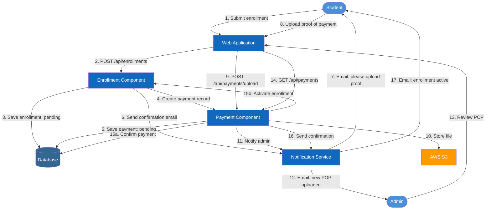
```mermaid
flowchart TD
    A([Student]) -->|1. Submit enrollment| B[Web Application]
    B -->|2. POST /api/enrollments| C[Enrollment Component]
    C -->|3. Save enrollment: pending| D[(Database)]
    C -->|4. Create payment record| E[Payment Component]
    E -->|5. Save payment: pending| D
    C -->|6. Send confirmation email| F[Notification Service]
    F -->|7. Email: please upload proof| A

    A -->|8. Upload proof of payment| B
    B -->|9. POST /api/payments/upload| E
    E -->|10. Store file| G[AWS S3]
    E -->|11. Notify admin| F
    F -->|12. Email: new POP uploaded| H([Admin])

    H -->|13. Review POP| B
    B -->|14. GET /api/payments| E

    E -->|15a. Confirm payment| D
    E -->|15b. Activate enrollment| C
    E -->|16. Send confirmation| F
    F -->|17. Email: enrollment active| A

    style A fill:#4A90D9,color:#fff
    style H fill:#4A90D9,color:#fff
    style B fill:#1168BD,color:#fff
    style C fill:#1168BD,color:#fff
    style E fill:#1168BD,color:#fff
    style F fill:#1168BD,color:#fff
    style D fill:#336791,color:#fff
    style G fill:#FF9900,color:#fff
```

---

## 8. C4 Level 5 — Deployment Diagram

This diagram shows how the Bello Beauty Academy Platform is deployed across infrastructure environments.

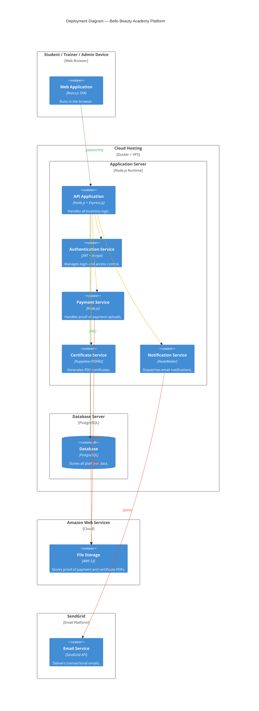
```mermaid
C4Deployment
    title Deployment Diagram — Bello Beauty Academy Platform

    Deployment_Node(mob, "Student / Trainer / Admin Device", "Web Browser") {
        Container(webApp, "Web Application", "React.js SPA", "Runs in the browser.")
    }

    Deployment_Node(cloud, "Cloud Hosting", "Docker + VPS") {
        Deployment_Node(app_server, "Application Server", "Node.js Runtime") {
            Container(api, "API Application", "Node.js + Express.js", "Handles all business logic.")
            Container(authSvc, "Authentication Service", "JWT + bcrypt", "Manages login and access control.")
            Container(paymentSvc, "Payment Service", "Node.js", "Handles proof of payment uploads.")
            Container(certSvc, "Certificate Service", "Puppeteer/PDFKit", "Generates PDF certificates.")
            Container(notifSvc, "Notification Service", "NodeMailer", "Dispatches email notifications.")
        }
        Deployment_Node(db_server, "Database Server", "PostgreSQL") {
            ContainerDb(db, "Database", "PostgreSQL", "Stores all platform data.")
        }
    }

    Deployment_Node(aws, "Amazon Web Services", "Cloud") {
        Container(storage, "File Storage", "AWS S3", "Stores proof of payment and certificate PDFs.")
    }

    Deployment_Node(sendgrid, "SendGrid", "Email Platform") {
        Container(email, "Email Service", "SendGrid API", "Delivers transactional emails.")
    }

    Rel(webApp, api, " ", "JSON/HTTPS")
    Rel(api, db, " ", "SQL")
    Rel(api, authSvc, " ")
    Rel(api, paymentSvc, " ")
    Rel(api, certSvc, " ")
    Rel(api, notifSvc, " ")
    Rel(paymentSvc, storage, " ", "HTTPS")
    Rel(certSvc, storage, " ", "HTTPS")
    Rel(notifSvc, email, " ", "SMTP")

    UpdateRelStyle(webApp, api, $textColor="#34a853", $lineColor="#34a853")
    UpdateRelStyle(api, db, $textColor="#34a853", $lineColor="#34a853")
    UpdateRelStyle(api, authSvc, $textColor="#f4a800", $lineColor="#f4a800")
    UpdateRelStyle(api, paymentSvc, $textColor="#f4a800", $lineColor="#f4a800")
    UpdateRelStyle(api, certSvc, $textColor="#f4a800", $lineColor="#f4a800")
    UpdateRelStyle(api, notifSvc, $textColor="#f4a800", $lineColor="#f4a800")
    UpdateRelStyle(paymentSvc, storage, $textColor="#e84d1a", $lineColor="#e84d1a")
    UpdateRelStyle(certSvc, storage, $textColor="#e84d1a", $lineColor="#e84d1a")
    UpdateRelStyle(notifSvc, email, $textColor="#e84d1a", $lineColor="#e84d1a")

    UpdateLayoutConfig($c4ShapeInRow="3", $c4BoundaryInRow="1")
```

---

## 9. Data Flow Description

### 9.1 Student Enrollment and Payment Flow (Cash / EFT)

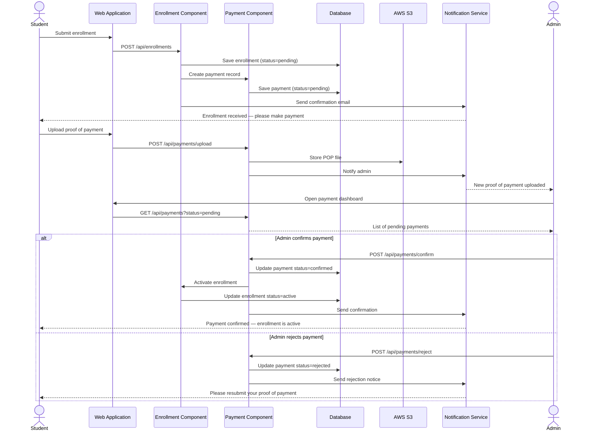
```mermaid
sequenceDiagram
    actor Student
    participant WebApp as Web Application
    participant Enroll as Enrollment Component
    participant Payment as Payment Component
    participant DB as Database
    participant S3 as AWS S3
    participant Email as Notification Service
    actor Admin

    Student->>WebApp: Submit enrollment
    WebApp->>Enroll: POST /api/enrollments
    Enroll->>DB: Save enrollment (status=pending)
    Enroll->>Payment: Create payment record
    Payment->>DB: Save payment (status=pending)
    Enroll->>Email: Send confirmation email
    Email-->>Student: Enrollment received — please make payment

    Student->>WebApp: Upload proof of payment
    WebApp->>Payment: POST /api/payments/upload
    Payment->>S3: Store POP file
    Payment->>Email: Notify admin
    Email-->>Admin: New proof of payment uploaded

    Admin->>WebApp: Open payment dashboard
    WebApp->>Payment: GET /api/payments?status=pending
    Payment-->>Admin: List of pending payments

    alt Admin confirms payment
        Admin->>Payment: POST /api/payments/confirm
        Payment->>DB: Update payment status=confirmed
        Payment->>Enroll: Activate enrollment
        Enroll->>DB: Update enrollment status=active
        Payment->>Email: Send confirmation
        Email-->>Student: Payment confirmed — enrollment is active
    else Admin rejects payment
        Admin->>Payment: POST /api/payments/reject
        Payment->>DB: Update payment status=rejected
        Payment->>Email: Send rejection notice
        Email-->>Student: Please resubmit your proof of payment
    end
```

---

### 9.2 Certificate Generation Flow

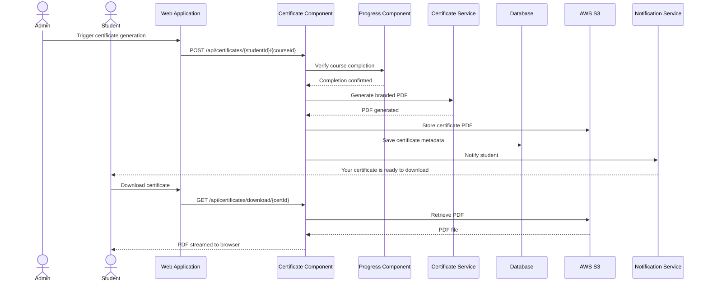
```mermaid
sequenceDiagram
    actor Admin
    actor Student
    participant WebApp as Web Application
    participant Cert as Certificate Component
    participant Progress as Progress Component
    participant CertSvc as Certificate Service
    participant DB as Database
    participant S3 as AWS S3
    participant Email as Notification Service

    Admin->>WebApp: Trigger certificate generation
    WebApp->>Cert: POST /api/certificates/{studentId}/{courseId}
    Cert->>Progress: Verify course completion
    Progress-->>Cert: Completion confirmed

    Cert->>CertSvc: Generate branded PDF
    CertSvc-->>Cert: PDF generated

    Cert->>S3: Store certificate PDF
    Cert->>DB: Save certificate metadata
    Cert->>Email: Notify student
    Email-->>Student: Your certificate is ready to download

    Student->>WebApp: Download certificate
    WebApp->>Cert: GET /api/certificates/download/{certId}
    Cert->>S3: Retrieve PDF
    S3-->>Cert: PDF file
    Cert-->>Student: PDF streamed to browser
```

---

### 9.3 Payment Status Lifecycle

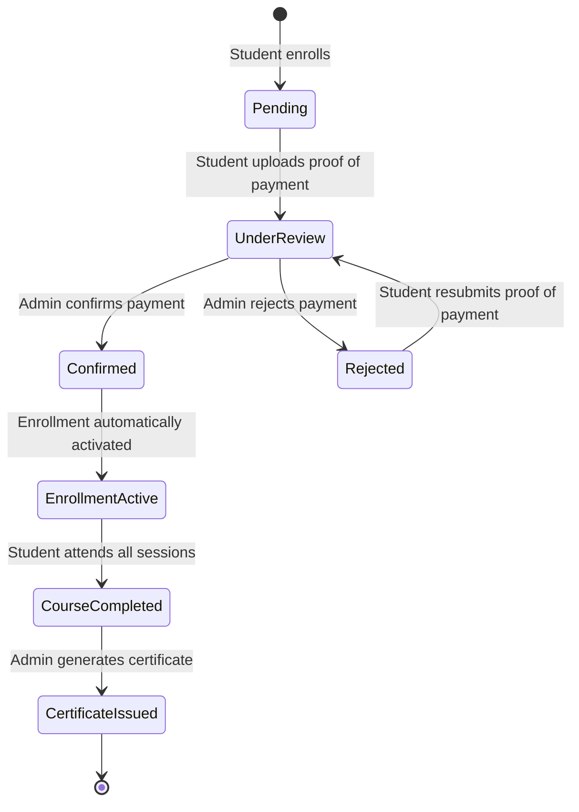
```mermaid
stateDiagram-v2
    [*] --> Pending : Student enrolls

    Pending --> UnderReview : Student uploads proof of payment

    UnderReview --> Confirmed : Admin confirms payment
    UnderReview --> Rejected : Admin rejects payment

    Rejected --> UnderReview : Student resubmits proof of payment

    Confirmed --> EnrollmentActive : Enrollment automatically activated

    EnrollmentActive --> CourseCompleted : Student attends all sessions

    CourseCompleted --> CertificateIssued : Admin generates certificate

    CertificateIssued --> [*]
```

---

## 10. Technology Stack

| Layer | Technology | Justification |
|-------|------------|---------------|
| Frontend | React.js | Component-based SPA; role-specific routing and dashboards |
| Styling | Tailwind CSS | Utility-first CSS for consistent, responsive UI |
| Backend | Node.js + Express.js | Full-stack JavaScript; lightweight REST API framework |
| Database | PostgreSQL | Robust relational DB with referential integrity constraints |
| Authentication | JWT + bcrypt | Stateless token auth; secure password hashing |
| File Storage | AWS S3 | Scalable cloud storage for POP uploads and certificate PDFs |
| Certificate Generation | Puppeteer / PDFKit | HTML-to-PDF rendering for branded certificates |
| Email Notifications | NodeMailer + SendGrid | Reliable transactional email delivery |
| Containerisation | Docker + Docker Compose | Reproducible dev and deployment environments |
| Version Control | Git + GitHub | Source control and project documentation |

---

## 11. API Documentation — Swagger UI

The REST API is fully documented using OpenAPI 3.0 and Springdoc OpenAPI. Once the application is running, the full interactive API documentation is available at:

```
http://localhost:8080/swagger-ui/index.html
```

The raw OpenAPI specification is available at `docs/openapi.yaml`.

### Overview — All Controllers

The Swagger UI shows all three controllers with their endpoints: student-controller, enrollment-controller, and course-controller.

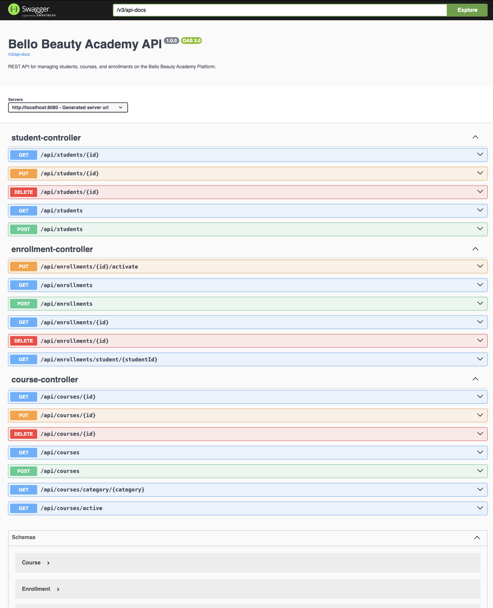

### Student Controller

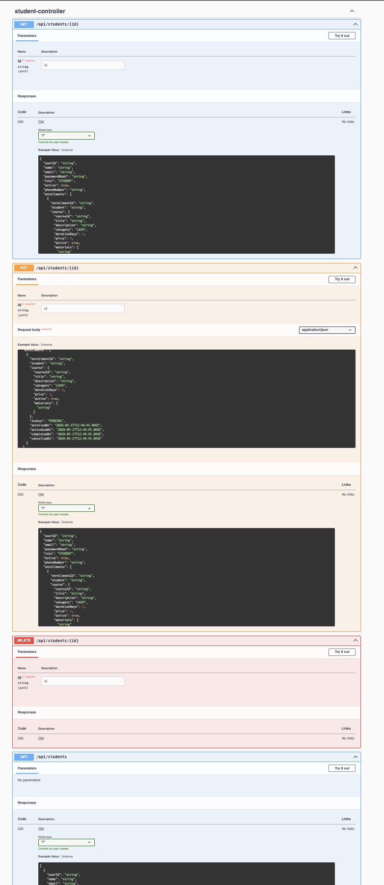

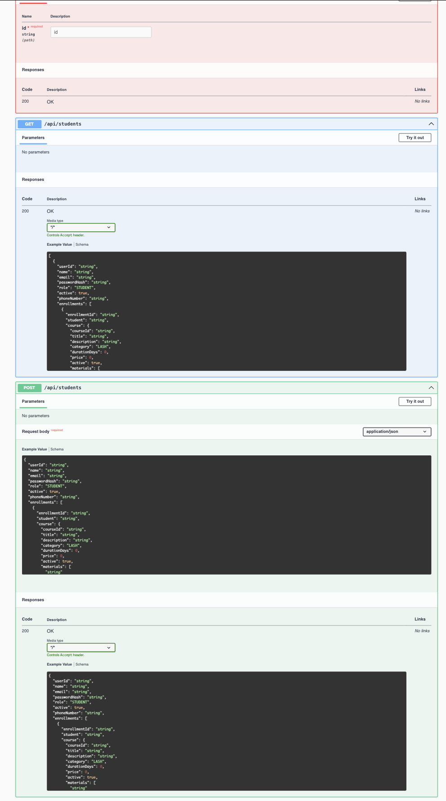

### Course Controller


### Enrollment Controller

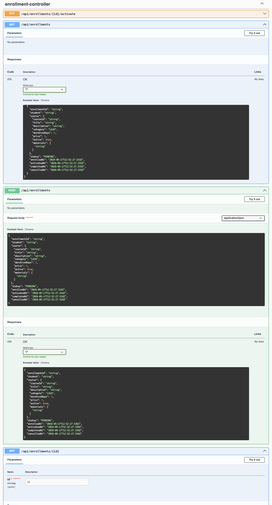

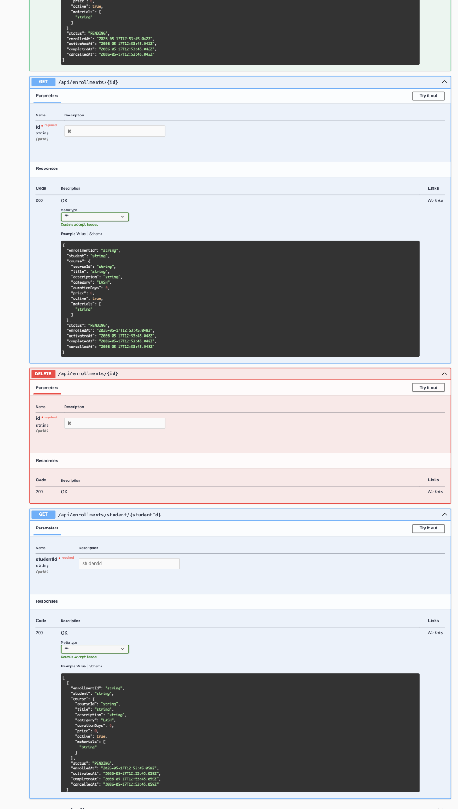


---

## 12. CI/CD Pipeline — GitHub Actions

The CI/CD pipeline is defined in `.github/workflows/ci.yml` and runs automatically on every push and pull request. See [PROTECTION.md](./PROTECTION.md) for the full branch protection configuration.

### Pipeline Overview — All Workflow Runs

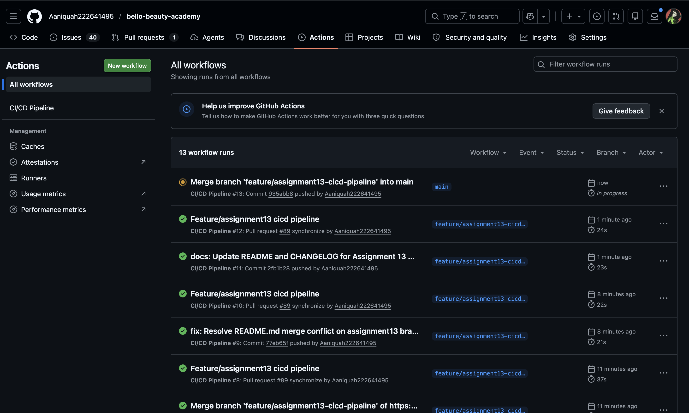

### Successful Pipeline Run — Both Jobs Passed

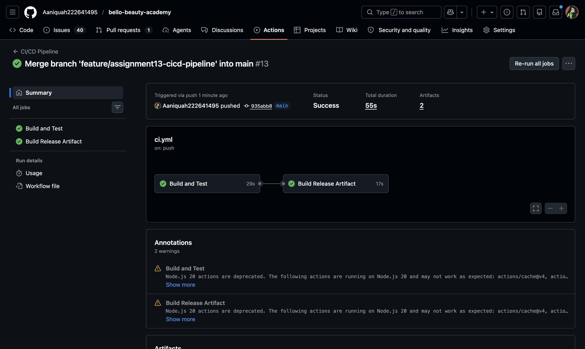

### Generated Artifacts — Release JAR and Test Reports

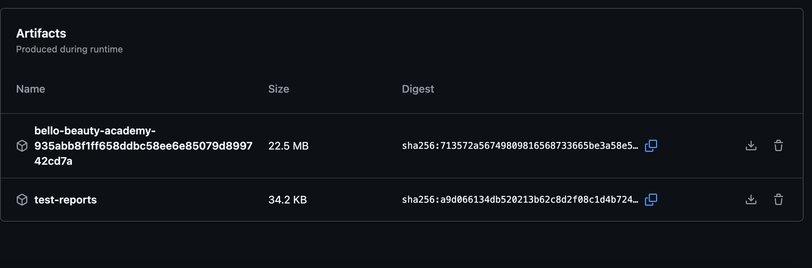

### Branch Protection Rules

Rule configuration showing PR required, 1 approval required, and Build and Test as required status check.

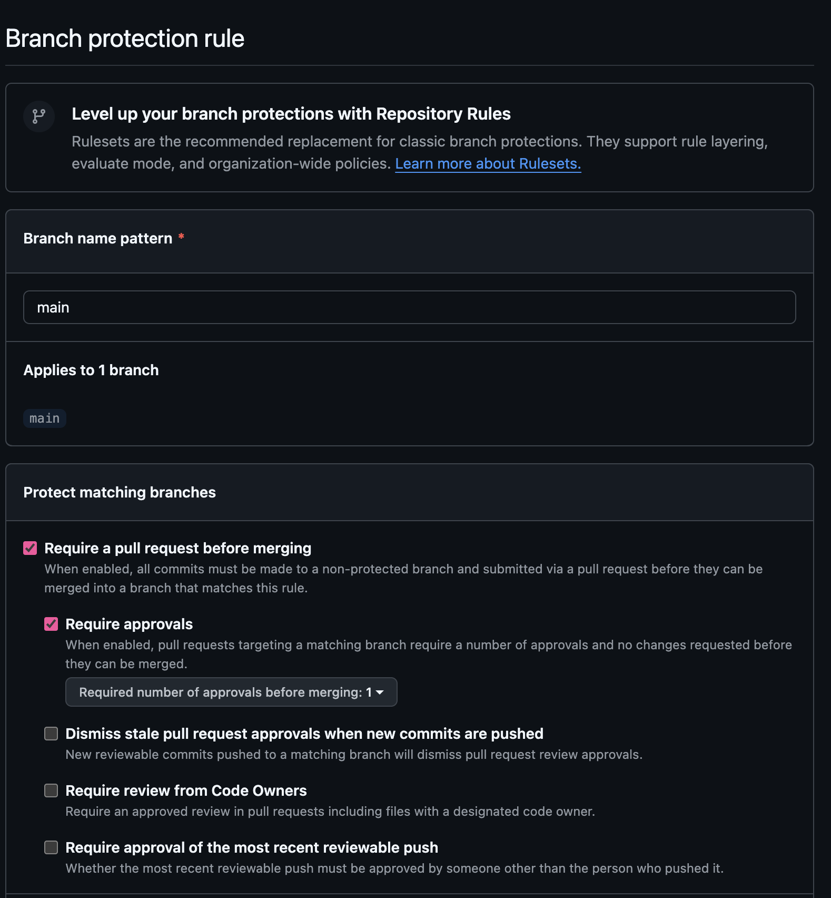

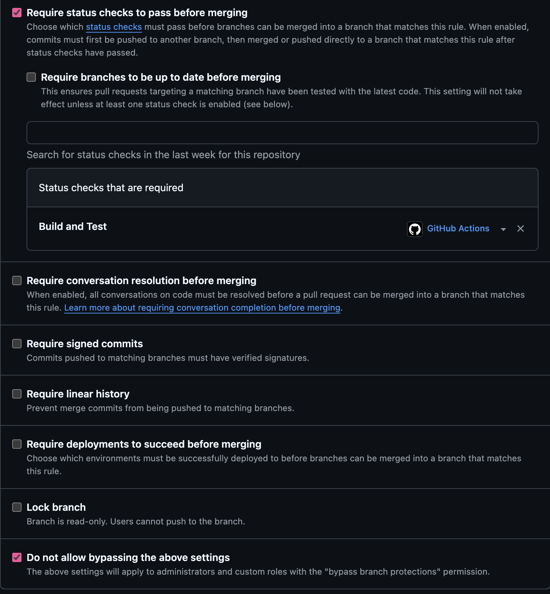

### Branch Protection in Action — Direct Push Blocked

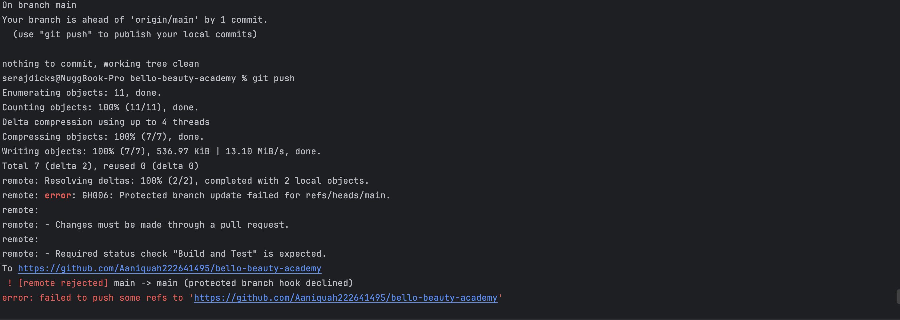

---

*End of ARCHITECTURE.md*